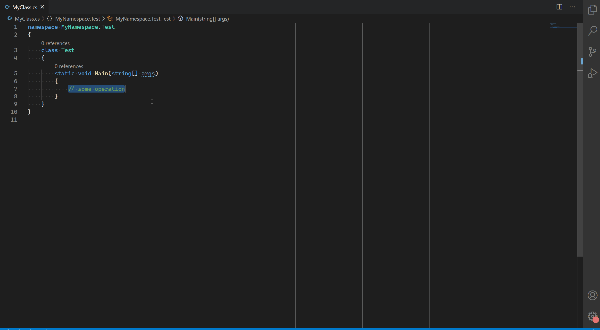
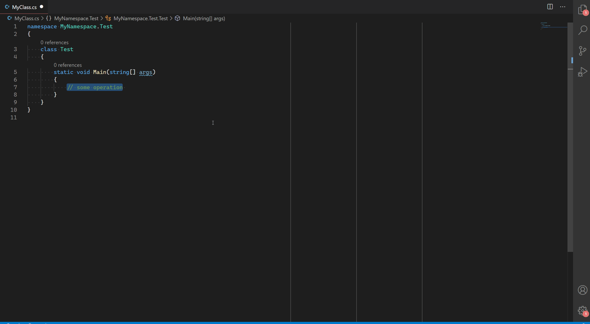

# Surround with CSharp

Brings support of surround-with functionality to vscode for C#. Inspiration comes from from *Visual Studio 2019*.

## Features

* You can surround you code based on two approaches:
  * Trigger snippet insertion as a Command
  * Trigger snippet insertion as a CompletionItem

## Supported Snippets

| Snippet     | Alias      | Keybinding          |
|-------------|------------|---------------------|
| namespace   | #namespace | CTRL+SHIFT+S N      |
| class       | #class     |                     |
| interface   | #interface |                     |
| struct      | #struct    |                     |
| enum        | #enum      |                     |
| if          | #if        | CTRL+SHIFT+S I      |
| dif         | #dif       |                     |
| else        | #else      | CTRL+SHIFT+S E      |
| do          | #do        | CTRL+SHIFT+S D      |
| while       | #while     | CTRL+SHIFT+S W      |
| for         | #for       | CTRL+SHIFT+S F      |
| foreach     | #foreach   | CTRL+SHIFT+S CTRL+F |
| reverse for | #forr      |                     |
| try-catch   | #try       | CTRL+SHIFT+S T      |
| try-finally | #tryf      | CTRL+SHIFT+S CTRL+T |
| lock        | #lock      | CTRL+SHIFT+S L      |
| checked     | #checked   |                     |
| unchecked   | #unchecked |                     |
| unsafe      | #unsafe    |                     |
| using       | #using     |                     |
| region      | #region    |                     |

### Demo: Surround via command

<!--  -->

### Demo: Surround via CompletionItem

<!--  -->

Action             | Alias                          | Shortcut
-------------------|--------------------------------|-------------------------------------
C#: Surround With  | `surround.with`                | `CTRL + SHIFT + S, CTRL + SHIFT + S`
Trigger completion | `editor.action.triggerSuggest` | `CTRL + SPACE`

## Known Issues

## Release Notes

Please see [CHANGELOG.md](./CHANGELOG.md)
